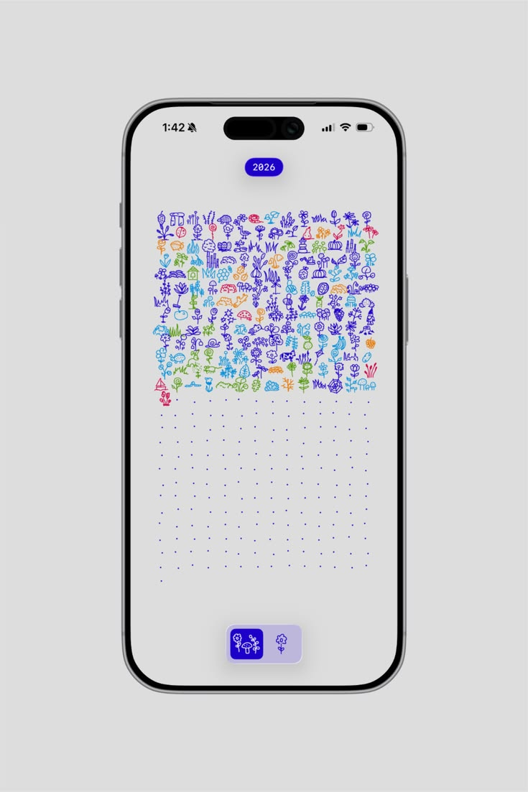

# Avatar jazdca — bicykel, ktorý ho zastupuje

**Stav:** 💡 Nápad — nič sa nestavia, nič nie je rozhodnuté
**Zapísané:** 20. 8. 2026
**Súvisí s:** [01-bicykle-na-pozadi.md](01-bicykle-na-pozadi.md) — stavia to na tom istom engine

⚠️ **Toto nie je plán a hlavne to nie je rozhodnutie o technológii.** Je to zápis rozpravy, aby
sa na to nezabudlo. Všetko technické nižšie je *odhad z augusta 2026* — kým na to príde reč,
môže sa ukázať jednoduchšie riešenie, iný stack alebo iný rozsah. Ber to ako poznámky
na pripomenutie, nie ako zadanie.

## O čo ide

Keď sa jazdec zaregistruje, zvolí si **bicykel, ktorý ho na webe zastupuje** — typ a farbu.
Ten bicykel sa potom objaví medzi ostatnými na pozadí. Čím viac prihlásených, tým viac bicyklov.

Zmysel nie je hra ani ozdoba. Je to **príslušnosť** — „to som ja, tam na tej stránke, spolu
s ostatnými, čakáme na preteky". Preto sa bicykel nedá ovládať a netreba k nemu nič vedieť hrať.

## Prečo to nie je hra — a prečo je to dôležité

Toto určuje celý rozsah: **nikto nič neovláda, nič sa nesynchronizuje v reálnom čase.** Je to
vykreslenie zoznamu, ktorý sa mení párkrát denne. Žiadny WebSocket, žiadny realtime, žiadne
riešenie konfliktov.

Pre engine z [01](01-bicykle-na-pozadi.md) to znamená jedinú zmenu:

```
dnes:   bicykel si parametre vyrobí sám       → Math.random()
potom:  bicykel parametre dostane zvonku      → [{typ, farba, ...}, ...]
```

**To je celá integrácia.** Preto sa oplatí engine na renderovanie z poľa konfigurácií prerobiť
kedykoľvek — aj dávno predtým, než niečo také existuje. V sandboxe sa to pole zatiaľ vygeneruje.

Vo chvíli, keď by sa bicykel dal ovládať, potrebujeme realtime, ochranu proti zneužitiu
a moderáciu — a začne to súperiť s tým, na čo web je. **Neovládateľnosť je funkcia, nie
obmedzenie.**

## Čo si jazdec volí

| Vlastnosť | Stav | Cena v grafike |
|---|---|---|
| **Typ** — fixka / cargo | dohodnuté, zatiaľ len tieto dva | celá sada snímok na typ |
| **Farba** — zo šiestich značkových | dohodnuté | **0 obrázkov** — prefarbuje sa v kóde |
| Brašne | ⬜ možnosť, nie rozhodnutie | ~5 obrázkov (nešliapu, stačí 1 na smer) |
| Vozík s vlajočkou | ⬜ možnosť, nie rozhodnutie | ~8–13 obrázkov + logika poradia vykreslenia |

⚠️ **Nesúlad s [01](01-bicykle-na-pozadi.md), ktorý treba raz doriešiť:** zadanie pre grafika tam
počíta s trojicou *mestský / velociped / cargo*. Avatar hovorí o *fixke / cargu*. Fixka v sade
zatiaľ neexistuje. Nie je to konflikt, ktorý treba riešiť teraz — len nech to nezapadne, kým sa
kreslí ďalej.

### Pozadie v produkčnej verzii: light / dark, žiadna rotácia

**Povedané 20. 8. 2026.** Rotácia šiestich farieb je vec **súčasnej landing page**, nie
produkčného webu. Ten bude mať **len svetlý a tmavý režim** a šesťfarebná paleta na pozadí
nebude.

Nie je to detail, mení to niekoľko vecí naraz:

- Prefarbovanie bicyklov rieši **dve témy namiesto šiestich rotujúcich pozadí** — čiže menej
  kombinácií v cache a jednoduchšia logika (viď čísla nižšie).
- Padá otvorená otázka z [01](01-bicykle-na-pozadi.md), či bude treba **dve nezávislé dvojice
  farieb**, aby bicykle držali kontrast aj na žltej. Žltá tam nebude.
- Hustá mriežka Depa dostane pokojné pozadie, na aké je stavaná.
- Šesť značkových farieb sa presúva **z pozadia na bicykle**. Tam ostáva farebnosť podujatia
  žiť — a je to zmysluplnejšie, lebo je viazaná na konkrétneho človeka.

### Prečo šesť farieb a nie picker

Dva dôvody, oba praktické:

1. Voľná farba sa musí uniesť na svetlom aj tmavom pozadí. Šesť značkových sa dá odladiť raz;
   ľubovoľná hodnota z pickera nie.
2. Prefarbený sheet sa cachuje. Pri voľnej farbe je cache **per-jazdec**, nie per-kombináciu —
   a to je rádový rozdiel (viď čísla nižšie).

Navyše „tvoj bicykel je jedna zo šiestich farieb ECMC" je lepší produkt než RGB picker, ktorý
vyrobí hnedú.

### Ako nechať doplnky otvorené a nezaplatiť za to

Otvorené sa to nechá **vo formáte, nie v kreslení**. Ak sa s grafikom dohodne kontrakt na
vrstvu — bunka 96 px, pevný kotviaci bod, dve nepriehľadné hodnoty, alfa výhradne 0/255 —
akýkoľvek doplnok sa pridá neskôr bez zásahu do kódu. Nekreslí sa nič dopredu.

Poznámka k vozíku, keby na neho niekedy prišlo: je *za* bicyklom, takže mení poradie
vykreslenia — pri jazde nahor sa kreslí **cez** bicykel, pri jazde nadol **pod** neho.

## Odvodený bicykel — inšpirácia blobatarom

**Zapísané 20. 8. 2026.** Zdroj: [blobatar.dev](https://blobatar.dev/),
[github.com/Alain00/blobatar](https://github.com/Alain00/blobatar), MIT. Prezreté vrátane
zdrojákov v npm balíku, nielen READMEčka.

Blobatar generuje avatar **z reťazca** — z prezývky, emailu, čohokoľvek. Rovnaký vstup dá vždy
rovnaký obrázok, nikde sa nič neukladá. Nás na ňom nezaujíma to, čo kreslí, ale **ako priraďuje
vlastnosti**, lebo to je presne odpoveď na náš default avatar (viď „Na čo nezabudnúť").

### Ako to funguje — tabuľka, ktorá neexistuje

Predstav si tabuľku, kde riadok je jazdec a stĺpec je vlastnosť:

```
              typ     farba   smer   brašne
pa3k          0.41    0.88    0.12   0.67
marek         0.93    0.05    0.71   0.30
```

Neukladá sa. Počíta sa zo slugu plus názvu stĺpca, a vyjde vždy rovnako. Číslo `0.41` sa potom
preloží na vlastnosť: `pick("typ", ["fixka", "cargo"])` → `0.41 × 2 = 0.83` → fixka.

Podstatné je, že číslo sa počíta **zo slugu a názvu stĺpca**, nie postupným čítaním zo
spoločného prúdu. Preto sú stĺpce navzájom nezávislé a nový stĺpec nepohne existujúcimi.

Zvyšné dve veci, ktoré tam riešia a inak by sa na ne zabudlo: podobné slugy musia dať úplne iné
čísla (`pa3k` vs `pa3l` nesmú mať skoro rovnaký bicykel — preto premiešavanie bitov, jednoduchý
hash tú vlastnosť nemá), a `Pa3k` vs `pa3k ` musí byť ten istý človek (normalizácia vstupu).

### Čo tým získame

**Default sa neprideľuje, odvodí sa zo slugu.** Nič sa neukladá — žiadny stĺpec v databáze,
žiadna migrácia, žiadny backfill pre tých, čo sa prihlásili skôr. Pri verejnom repe a GDPR je
neuložený údaj vždy lepší než uložený. A vyzerá to ako voľba, aj keď ju nikto neurobil.

**Editor je override nad odvodeným základom, nie druhý režim.** Keď si jazdec zvolí typ a farbu,
tie dve hodnoty sa dosadia a ostatné sa naďalej berú z odvodenia. Jeden renderer, jedna cesta
v kóde.

**Doplnky sa dajú pridať bez toho, aby sa niekomu zmenil bicykel.** V sekcii „Ako nechať doplnky
otvorené" je vyriešená grafická polovica problému (kontrakt na vrstvu). Toto je tá druhá: ak sa
brašne raz pridajú ako nový stĺpec, nikomu, kto si ich nezvolil, sa nič nezmení. Pri sekvenčnom
čítaní z hashu by sa v marci premiešali všetci — vrátane ľudí, čo už majú screenshot `/r/<slug>`
na Instagrame. Je to tá istá trieda chyby ako „štartové číslo ako ID v URL" v Zamietnutých:
tichý rozpad vecí, ktoré sú už vonku a nedajú sa opraviť.

**Stabilné maličkosti zadarmo.** Fázový posun trackstandu a smer zaparkovania v mriežke sú dnes
`Math.random()`, čiže iné pri každom načítaní. Odvodené zo slugu sú stále rovnaké — bicykel sa
kýve vždy tak isto a v mriežke stojí vždy rovnako otočený. Drobnosť, ale je to presne to
„to som ja". A keby sa raz renderovalo aj na serveri (OG obrázok, SSR), odpadá nesúlad medzi
serverom a klientom.

**Ich argument pre šesť farieb je lepší než náš.** V „Prečo šesť farieb a nie picker" máme dva
dôvody, oba technické (pamäť, kontrast). Blobatar necháva seed hýbať **iba odtieňom**, kým
svetlosť a sýtosť sú autorské konštanty — šesť ručne odladených tónov. Komentár v ich zdrojáku:
*nechať seed voľne behať po svetlosti a sýtosti je presne to, čo spôsobí, že generované palety
vyzerajú generovane.* To je estetický dôvod pre to isté rozhodnutie a stojí za to ho mať zapísaný.

### ⚠️ Pasca: zoznamy sa nesmú meniť

Ak k `["fixka", "cargo"]` pribudne tretí typ, tak `0.41 × 3 = 1.25` → index 1 → **cargo**. Ten
istý jazdec, nezmenený slug, a bicykel sa mu prevrátil — len preto, že sa zoznam predĺžil.

Takže: nové vlastnosti sa **pridávajú ako nové stĺpce** (to je bezpečné), ale existujúce zoznamy
a číselné rozsahy sa **zmrazia**. Priamo to súvisí s otvorenou otázkou, či fixka nahrádza mestský
a velociped, alebo k nim pribúda — **to sa musí rozhodnúť skôr, než sa pridelí prvý odvodený
bicykel**, lebo potom sa zoznam typov už nedá zmeniť bez premiešania všetkých.

### Čo z toho nepoužijeme

**Kreslenie.** Blobatar generuje tvar procedurálne z matematiky (jedna superelipsa
`|x/a|ⁿ + |y/b|ⁿ = 1`, kde „tvar hlavy" je len číslo `n`). My máme kreslené sprity od grafika
s pevným kontraktom. Žiadny vzorec nevyrobí bicykel, ktorý k tej sade sedí. Väčšina ich repa je
pre nás nepoužiteľná — berieme si z neho ~60 riadkov, nie knižnicu.

**A nerieši nám to opakovanie.** Blobatar vyzerá dobre, lebo má priestor v desiatkach tisíc
kombinácií. My máme 12 vzhľadov. Ak si požičiame mechanizmus a necháme 12 vzhľadov, riziko
tapety z „⚠️ Riziko: opakovanie" sa nezlepší ani o kúsok — to riešia ďalšie osi (smer
zaparkovania), nie odvodzovanie.

### Kedy to spraviť

**Dá sa hocikedy, aj teraz.** Nepotrebuje to backend ani registráciu — je to čistá funkcia zo
stringu. V sandboxe by sa pole konfigurácií generovalo zo zoznamu vymyslených slugov namiesto
`Math.random()`, čo je presne to, o čom hovorí sekcia „Prečo to nie je hra": engine sa oplatí
prerobiť na renderovanie z poľa konfigurácií dávno predtým, než to pole má odkiaľ prísť.

## Depo — stránka, kde sú všetci

Pri 300 jazdcoch na titulke nastanú dva problémy naraz: je to vizuálny chaos a **nikto v tom
nenájde ten svoj**, čo je celá pointa. Preto rozdelené:

| Kde | Čo tam je |
|---|---|
| **Titulka** | posledných 10–20 prihlásených. Sľub „viac ľudí = viac bicyklov" ostáva cítiť. |
| **Depo** | všetci. Klik na bicykel = popisok. |

Pracovný názov je **Depo** — miesto, kde kuriéri čakajú medzi jazdami. Zvažovali sa aj *Manifest*
(v kuriérskom žargóne doslova zoznam zásielok) a *Dispatch*. **HQ nepoužívať** — to je v ECMC
svete fyzické miesto podujatia a bude na mape.

Vedľajší efekt „posledných 20" na titulke: keď sa prihlásiš, si na titulke. To je dôvod poslať
tam kamaráta hneď po registrácii aj vrátiť sa pozrieť, kto pribudol.

### Jedna obrazovka, nie mapa

Dohodnuté: **jedna obrazovka**, bicykle menšie. Posúvateľná mapa až keby sa ukázalo, že to inak
nejde — je to výrazne viac kódu a na mobile ďalšia vrstva problémov s gestami.

Na hustotu si treba dať pozor, to číslo prekvapí: **300 bicyklov po 60 px zaberie zhruba polovicu
bežnej obrazovky.** To už nie je dav, to je koberec. Pri 40 px je to ~20 %, čo sa ešte číta ako
skupina ľudí.

### Mriežka — východiskový režim Depa

**Dohodnuté 20. 8. 2026.** Depo má dva režimy a **mriežka je východisková**; voľný rozsyp je
druhý. Depo je adresár — ideš tam niekoho nájsť, a na to je mriežka lepšia. Voľný pohyb patrí
na titulku, kde je dvadsať bicyklov kulisou za obsahom.



*Referencia: screenshot cudzej denníkovej aplikácie (názov neznámy). Držaný tu ako vizuálna
poznámka, nie ako predloha na kopírovanie.*

Mriežka rieši dve veci, ktoré rozsyp nevie:

- **Bez prekrytí.** 300 bicyklov v rozsype zaberie ~47 % obrazovky a je z toho koberec.
  Mriežka ich uloží tesne vedľa seba a nič sa neprekrýva.
- **Mriežka je číslo.** Rozsyp skrýva, koľko ich je. Blok tristo bicyklov ten počet ukáže bez
  toho, aby ho niekto musel napísať.

A nájsť sa v nej dá — v rozsype je „ten farebný" k ničomu, ak je za logom; v mriežke má každý
pevné miesto.

#### ⚠️ Riziko: opakovanie

Referencia funguje preto, že **každý deň je iná kresba** — je tam dvesto unikátnych vecí a to je
celý pôvab.

My máme 2 typy × 6 farieb = **12 vzhľadov**. Pri 300 jazdcoch je to 25 kópií od každého, čo sa
neprečíta ako tristo ľudí, ale ako tapeta. **Toto je na mriežke to jediné, čo ju môže pokaziť,
a pri kreslení sa na to ľahko zabudne.**

Tri cesty von, dajú sa kombinovať:

1. **Smer zaparkovania ako ďalšia os.** Bicykel v boxe nemusí stáť vždy rovnako — 5 smerov × 12
   = 60 vzhľadov, a **nula nových spritov**, sady to už obsahujú. Najlacnejší zdroj rozmanitosti,
   aký existuje.
2. **Priznať opakovanie a zoradiť podľa neho.** Pri zoradení podľa farby a typu sú z opakovania
   zámerné bloky — vyzerá to ako vzorkovník, nie ako chyba.
3. Doplnky, ak na ne raz dôjde — každý ďalší prvok počet vzhľadov násobí.

Vedľajší dôsledok: smer zaparkovania je aj **rozhodnutie o balení**. Bicykel zboku je široký
a nízky, takže v štvorcovej bunke 96 px nechá polovicu výšky prázdnu; pohľady spredu/zozadu sú
úzke a vysoké. Buď sa tomu prispôsobí tvar bunky, alebo sa smery zvolia tak, aby mriežka sadla.

#### Statické neznamená mŕtve — trackstand

Úplne nehybná mriežka sa prečíta ako graf, nie ako „ľudia čakajú na preteky".

Riešenie je už v [01](01-bicykle-na-pozadi.md): **trackstand**. Každý bicykel stojí vo svojom boxe
a jemne sa kýve, každý s vlastným fázovým posunom. Tristo bicyklov držiacich trackstand
v mriežke je lepší obraz než čokoľvek, čo by robili v pohybe — a je to reálna disciplína ECMC,
takže to nie je ozdoba. Nula nových spritov nad rámec toho, čo je aj tak v zadaní.

#### Prechod medzi režimami — „zaparkovanie"

Nie „prepnúť zobrazenie", ale **zaparkovať**: bicykle sa z rozsypu rozídu na svoje miesta
v mriežke. Zmena zoradenia je to isté — prejdú do nových boxov.

Engine to už skoro vie, lebo vie ísť smerom k bodu; cieľ len prestane byť náhodný a stane sa ním
pridelený box. Je to zopár riadkov nad existujúcim kódom a je to presne tá vec, ktorú si ľudia
nahrajú a hodia na Instagram.

Tým sa zároveň vyrieši filter lepšie než zhlukmi — **zhluky sú neurčité, boxy sú presné.**

#### Východiskové zoradenie: poradie prihlásenia

Referencia je zoradená chronologicky, deň po dni. To sa dá vziať doslova: **poradie registrácie
je jediné zoradenie, ktoré máme vždy.** Krajiny sa dajú spočítať až keď je koho, štartové čísla
vzniknú mesiac pred pretekmi — ale poradie prihlásenia existuje od prvého jazdca a nikdy sa
nezmení.

Dá to jazdcovi ďalší osobný údaj, ktorý mu nikto nezoberie: *„prihlásil si sa ako 47."* Sedí to
k rozdeleniu slug / štartové číslo — je to fakt, nie pridelená hodnota.

#### Prázdne miesta = voľné kapacity

V referencii sú pod vyplnenou časťou bodky pre dni, ktoré ešte neprišli. U nás by to boli
**miesta, ktoré ešte nie sú obsadené** — a to nie je dekorácia, to je dôvod sa prihlásiť.

⚠️ **Podmienené stropom, ktorý zatiaľ nepoznáme.** Ak sa počet neobmedzuje, mriežka len rastie
a bodky nemajú čo znázorňovať. Patrik to preberie s organizačným tímom. A pozor na druhú stranu
tej istej mince: mriežka zverejní nielen počet prihlásených, ale aj **koľko miest sa nepredalo**
(viď „Počet je verejný údaj" nižšie).

#### Dva vedľajšie zisky

- **Mobil.** Referencia je screenshot z telefónu, a nie náhodou — mriežka sa scrolluje, rozsyp
  nie. `01` má správanie na mobile ako otvorenú dieru; toto je naň odpoveď.
- **`prefers-reduced-motion`.** Statická mriežka nie je ochudobnená verzia, ale plnohodnotný
  režim. Povinnosť sa tým mení na funkciu.

### Filtre, ktoré preskupujú

Toto je najlepšia príležitosť celej stránky a je skoro zadarmo, lebo engine už vie hýbať vecami:
filter neprekreslí zoznam, ale **rozoženie bicykle do zhlukov** — podľa krajiny, podľa typu.
Nemci k Nemcom. Vyhľadanie mena ide tou istou cestou ako unikátna URL nižšie.

**Odpočet do pretekov** na tej istej stránke — až keď bude známy termín (viď
[06-otvorene-otazky.md](../06-otvorene-otazky.md)).

Po podujatí sa Depo stane archívom s výsledkami. Web tak neumrie deň po pretekoch.

## Unikátna URL jazdca

`/r/<slug>` zvýrazní jeho bicykel: **ostatní zošedivejú, jeho ostane farebný.**

Technicky je to lacnejšie než bežné zobrazenie, nie drahšie — greyscale nie je filter, ale iná
dvojica farieb v tom istom prefarbovaní. Namiesto ~12 prefarbených sheetov stačia 2 sivé
a 1 farebný.

Tri detaily, ktoré ten moment rozhodnú:

1. **Greyscale nech nabehne až po sekunde.** Chvíľu vidí farebné pole, potom farba odtečie zo
   všetkých okrem jeho. To je ten „to som ja" moment. Šedá od prvého snímku sa prečíta ako
   „stránka je šedá".
2. **Zvýraznený bicykel musí byť nájditeľný** — nech štartuje v strede a nesie menovku. Farba
   potvrdzuje, poloha nájde. „Ten farebný" je pri 300 kusoch na nič, ak je za logom.
3. **Vlastný náhľadový obrázok pre každého jazdca** (OG image) — jeho bicykel farebne, meno,
   číslo. To je to, čo sa reálne objaví na Instagrame; link bez náhľadu je polovičná vec.

To je zároveň jediný dôvod, prečo sa táto vec môže sama zaplatiť: **ľudia zdieľajú svoj bicykel
a tým lákajú ďalších.**

## Slug ≠ štartové číslo

Dve nezávislé veci, a je dôležité ich nemiešať:

| | Kedy vzniká | Mení sa? | Na čo |
|---|---|---|---|
| **slug** | pri registrácii | nikdy | `/r/<slug>`, to sa zdieľa |
| **štartové číslo** | ~mesiac pred pretekmi | áno | zobrazuje sa v popisku |

Prečo nie číslo ako ID: čísla sa prideľujú po uzávierke, ľudia odpadnú, kategórie sa preskupia,
a hlavne — main race, cargo a vedľajšie disciplíny môžu mať vlastné číslovanie, takže „142"
nemusí byť unikátne. Jeden človek môže mať dve čísla. Keby bolo číslo kľúčom v URL, prečíslovanie
rozbije všetky už zdieľané odkazy — vrátane tých na Instagrame, ktoré sa nedajú opraviť.

Bonus, ktorý si tým kúpime: `/r/142` môže byť **presmerovanie na aktuálneho držiteľa čísla 142**.
Počas pretekov niekto uvidí číslo na chrbte a vie si ho vyhľadať. Pri číselnom ID by to
nefungovalo, lebo tam je číslo zamrznuté v čase.

**Dôsledok pre dizajn: bicykel musí vyzerať hotovo aj bez čísla**, lebo pol roka žiadne nebude.

## Verejný popisok

Nick, krajina, štartové číslo, typ bicykla, tím / mesto. Ďalšie sa doplní, ak bude treba.

❌ **Číslo sa nekreslí na sprite.** Bicykel má na obrazovke 40–80 px na dĺžku, dvojciferné číslo
v ňom má výšku 5–6 px — neprečítateľné, a navyše by grafik musel v každom smere a každej snímke
rezervovať plochu na tabuľku. Číslo patrí do popisku pri kliknutí (tooltip) a pod zvýraznený
bicykel pri unikátnej URL. Tam je vysádzané normálnym písmom a stojí nula obrázkov.

## Technická poznámka — nezáväzná

⚠️ Toto je odhad z augusta 2026, nie voľba stacku. Keď na to príde rad, môže to vyzerať inak
a jednoduchšie.

Vtedajšia úvaha bola: Next.js na Verceli (už je odporúčaný v
[05-rozsah-webu.md](../05-rozsah-webu.md)), Supabase Postgres na dáta, prihlásenie cez **magic
link** namiesto hesiel (jednorazové podujatie — heslo, ktoré nikto nepoužije druhýkrát, je len
záťaž a únik navyše), Stripe na platbu. Renderer ostáva čistý modul s jedným `<canvas>`; bicykle
nikdy nepatria do React state.

Dáta sa nemenia často, takže **žiadny realtime** — statický JSON, preplatený po registrácii.
Dva súbory, nie jeden: malý pre titulku (posledných 20) a celý pre Depo. Titulka nemá sťahovať
300 jazdcov kvôli dvadsiatim.

## Čísla, ktoré sa oplatí pamätať

Aby sa k nim netreba prehrýzať znova:

| Čo | Koľko |
|---|---|
| Jeden prefarbený sheet novej sady (384 × 480 px) v pamäti | ~720 kB |
| Voľná farba, 300 jazdcov → cache per-jazdec | **~216 MB** — zabije mobil |
| 6 farieb × 2 typy v aktívnej téme → cache per-kombináciu | ~8,6 MB |
| Greyscale + jeden zvýraznený | **~2,2 MB** |
| Verejný JSON, 300 jazdcov | ~12 kB, po gzipe ~3 kB |
| 300 bicyklov po 60 px na bežnej obrazovke | ~47 % plochy — priveľa |
| 300 bicyklov po 40 px | ~21 % plochy — číta sa ako dav |

## Na čo nezabudnúť

- **Default avatar sa musí prideliť automaticky** po zaplatení. Väčšina ľudí editor nikdy
  neotvorí, a keby mali prázdny avatar, Depo by boli tri stovky identických bicyklov. Takto je
  každý na ploche hneď a úprava je bonus, nie podmienka. Ako na to bez ukladania čohokoľvek:
  viď „Odvodený bicykel — inšpirácia blobatarom".
- **Súhlas a GDPR.** Repo je verejné a dáta účastníkov v ňom nesmú byť (viď `CLAUDE.md`). Verejný
  JSON smie obsahovať len to, čo jazdec odklikol, že sa má ukázať. Voľba pri registrácii: meno /
  prezývka / anonymne. Tabuľku nevystavovať priamo do prehliadača.
- **Moderácia.** Prezývka je vstup od používateľa na verejnej stránke. Treba admin prepínač
  „skryť jazdca". Toto sa človek inak naučí po prvom vtipálkovi.
- **Počet je verejný údaj.** Bicykle prezradia, koľko ľudí sa prihlásilo. Ak sa v januári
  prihlásia štyria, stránka to bude kričať. Riešenie: zapnúť to až nad prahom, alebo doplniť
  „duchov" na minimálny počet.
- **`prefers-reduced-motion`** — rovnaká povinnosť ako pri [01](01-bicykle-na-pozadi.md).

## Zamietnuté

- ❌ **Vlastný chat** (20. 8. 2026) — moderácia, GDPR, ukladanie, spam a zodpovednosť 24/7,
  pričom 90 % času tam bude ticho. Komunita už niekde je (Instagram, prípadne skupina).
  Stačí **odkaz**: jeden riadok, nula kódu, nula rizika. Späť sa to dá pridať kedykoľvek,
  opačne nie.
- ❌ **Štartové číslo na sprite** (20. 8. 2026) — neprečítateľné, a zdraží každú snímku. Do
  popisku.
- ❌ **Voľná paleta / RGB picker** (20. 8. 2026) — pamäť, a čitateľnosť na svetlom aj tmavom
  pozadí sa nedá odladiť pre ľubovoľnú hodnotu.
- ❌ **Štartové číslo ako ID v URL** (20. 8. 2026) — prečíslovanie rozbije zdieľané odkazy.

## Otvorené

- **Existuje strop počtu účastníkov?** Bez neho nedávajú prázdne miesta v mriežke zmysel.
  Patrik to preberie s organizačným tímom.
- Názov stránky — *Depo* je zatiaľ pracovný
- Či fixka nahrádza mestský a velociped, alebo pribúda k nim (viď nesúlad vyššie).
  ⚠️ Ak sa pôjde cestou odvodeného bicykla, **toto sa musí rozhodnúť skôr, než sa pridelí prvý
  odvodený bicykel** — potom sa zoznam typov nedá zmeniť bez premiešania všetkých.
- Brašne a vozík — možnosť, nie rozhodnutie
- Editor avatara pred registráciou (postav si bicykel, potom sa prihlás) vs. až po zaplatení
