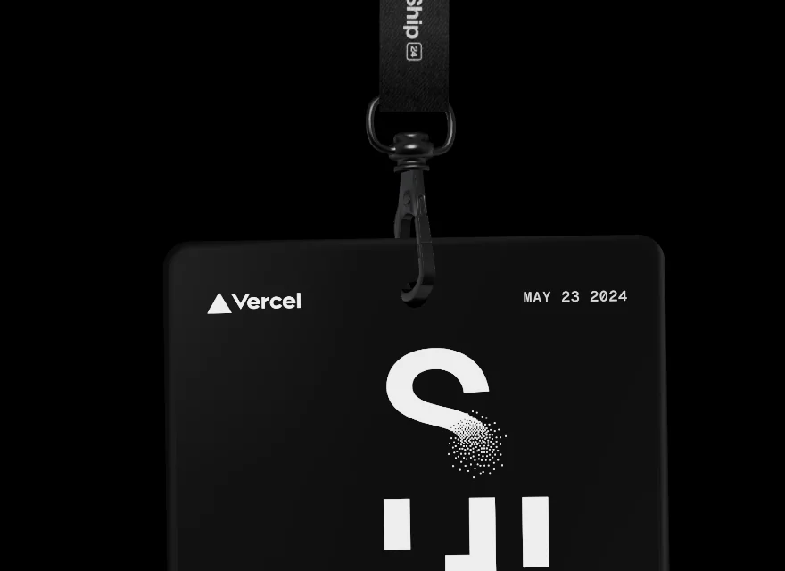
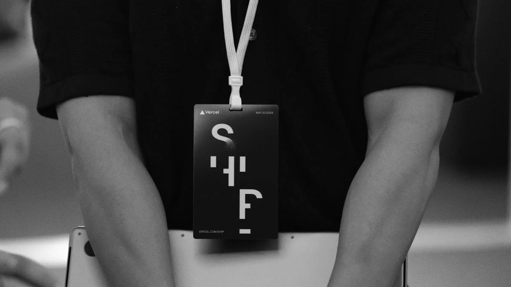

# Spoke card generátor — karta, ktorá vyjde z webu do kolesa

**Stav:** 💡 Nápad — nič sa nestavia, nič nie je rozhodnuté
**Zapísané:** 24. 8. 2026, doplnené 24. 8. 2026 o interaktívnu 3D kartu
**Súvisí s:** [02-avatar-jazdca.md](02-avatar-jazdca.md) — bicykel jazdca môže byť grafikou na
karte; zápis tam už spoke card raz spomína (viď „Vzťah k avatarovi" nižšie)

⚠️ **Toto nie je plán ani rozhodnutie o technológii.** Je to zápis rozpráv z 24. 8. 2026, aby sa
na to nezabudlo. Všetko technické nižšie je odhad — kým na to príde reč, môže sa ukázať
jednoduchšie riešenie, iný stack alebo iný rozsah.

📌 **Toto je vec produkčného webu, nie súčasnej landing page.** Nič z toho sa neposudzuje podľa
toho, čo dnes utiahne jeden HTML súbor. Stack sa zvolí podľa toho, čo generátor potrebuje, nie
naopak. Rovnako **farby v tomto dokumente nie sú finálne** — viď „Paleta" nižšie.

## O čo ide

Verejný generátor spoke cards. Človek si na webe poskladá vlastnú kartu:

- **predefinovaná grafika** podujatia — tvar je daný, nekreslí si ju sám
- **voľba farby** grafiky
- **pozadie** — buď jedna z preddefinovaných fotiek, alebo vlastná nahratá

Výsledok si môže stiahnuť a vytlačiť ktokoľvek. Kto si ju **objedná**, tomu ju vyrobíme —
vytlačíme, zalaminujeme, zrežeme na správny rozmer a odovzdáme na mieste.

Ambícia je vedome vysoká: **nie hračka na jedno kliknutie, ale poriadny nástroj.**

## Rešerš — čo je spoke card a odkiaľ sa vzala

Overené 24. 8. 2026. Odkazy sú v [docs/zdroje.md](../zdroje.md).

Spoke card je **laminovaná karta zastrčená medzi špice zadného kolesa**, rovnobežne s kolesom.
Nie je to ozdoba, ktorú si niekto vymyslel — je to **priamo kuriérsky vynález a v podstate
pretekárske štartové číslo**.

| Kedy | Čo |
|---|---|
| pôvod | Lacná náhrada za plastovú tabuľku so štartovým číslom na alleycatoch. Na začiatku sa brali **tarotové karty** a dopísalo sa na ne číslo pretekára. |
| 90. roky, San Francisco | Druhý zdroj: hra **Spokepoker** — hracie karty nájdené na ulici sa strkali do špíc. |
| dnes | Tlačí sa na mieru. Používajú to aj Critical Mass a podobné hromadné jazdy. |
| posun významu | Karta sa stala aj **pamiatkou na zabitých kuriérov**, politickým nosičom (vrátane amerických volieb 2008) a artefaktom samým o sebe. |

**Podstatné pre nás — ľudia si ich nechávajú a roky zbierajú.** Mediamatic má online archív
kariet z celého sveta od 90. rokov po rok 2009, požičaný od jedného pretekára. To nie je papierik,
ktorý skončí v koši po pretekoch.

### ECMC to má v tradícii

- **ECMC 2009 Berlín** — karta so štylizovanou siluetou mesta a číslom pretekára.
- **ECMC 2016 Kodaň** — spoke cards a štartové čísla robil ilustrátor **Jody Barton** ako súčasť
  vizuálnej identity podujatia.
- **CMWC 1998** — vpredu sponzori, **vzadu dopísaný čas pretekára**.
- Robili sa **rôzne verzie pre rôzne roly** — iná pre pretekára, iná pre crew.

Čiže robiť spoke card nie je nápad zvonku. Je to **splnenie očakávania**, ktoré komunita má.

### Rozmer

Norma neexistuje. Ustálilo sa to okolo:

- **~3,5 × 3,5 palca** (≈ 89 mm) štvorec — najbežnejšie
- alebo obdĺžnik ~4 × 2,5 palca

Laminuje sa s **presahom ~1 cm okolo**, inak sa to v kolese rozpadne. Rohy sa väčšinou zaoblia.

### Existujúce nástroje — čo sa dá odpozerať

Hľadané 24. 8. 2026, aby sme vedeli, či niekde nie je hotový nástroj, z ktorého sa dá vyjsť.
Našli sa len DIY návody typu „vystrihni si štvorec z tvrdého papiera" a **Bike Index**, ktorý
tlačí karty s QR kódom na registráciu bicykla proti krádeži. Webový generátor spoke cards sme
nenašli žiadny.

Takže **dizajn generátora je celý náš** — od toho, čo si človek volí, cez logiku série až po
tlačový výstup. Nie je to prekážka, je to práve tá práca, ktorú tu chceme spraviť: prvý nástroj
tohto druhu a zároveň vizuál ECMC 2027.

## Prečo to stojí za to

**Je to jediný z našich nápadov, ktorý vyjde z obrazovky von.** Bicykle na pozadí aj Depo žijú
v prehliadači — zavrieš tab a je po nich. Spoke card si človek zastrčí do kolesa, prejazdí s ňou
celý víkend po Bratislave, odvezie si ju domov do Berlína a o desať rokov je v takej zbierke ako
tie z Mediamaticu. To je iná trieda vecí.

**Generátor je marketing sám o sebe.** Človek si vyrobí kartu, dostane obrázok, hodí to na
Instagram. Organický dosah presne v tej komunite, ktorú potrebujeme osloviť — a funguje mesiace
pred podujatím.

**Neblokuje ho nič z [06-otvorene-otazky.md](../06-otvorene-otazky.md).** Nepotrebuje termín,
miesto ani právny subjekt. Verejný režim sa dá spustiť skôr než registrácia; objednávka výroby
sa nabalí neskôr.

**Nápad je už správne obmedzený.** Grafika je predefinovaná, mení sa jej farba — takže všetky
karty ostanú čitateľné ako **jedna séria**, ako vizuál ECMC 2027. To je tá istá logika, prečo má
avatar šesť farieb a nie RGB picker (viď [02](02-avatar-jazdca.md), „Prečo šesť farieb a nie
picker"). Variabilita vnútri systému, nie chaos.

## Dva režimy

Dohodnuté v rozprave 24. 8. 2026, detaily sa doladia.

| | **Hosť — ktokoľvek** | **Držiteľ lístka — prihlásený** |
|---|---|---|
| kto | ktokoľvek na internete | človek, ktorý si kúpil lístok |
| čo dostane | tlačový súbor na stiahnutie, vytlačí si sám | **vyrobíme mu ju** — tlač, laminovanie, orez |
| údaje | žiadne | doplní si údaje potrebné na výrobu a odovzdanie |
| potvrdenie | — | **drobné potvrdenie „objednávky"** — jeden krok, nie e-shop |

Kľúčové je, že **generátor je verejný pre kohokoľvek**. Nie je to odmena za registráciu, je to
otvorená vec — a práve preto sa šíri.

⚠️ **Nie je dohodnuté** a treba doriešiť:

- Či môže objednať výrobu aj neprihlásený človek (a ako by ju potom dostal — pošta? vyzdvihnutie
  na mieste?).
- Čo presne znamená „drobné potvrdenie" — či je za to symbolická platba, alebo len klik.
- Aké údaje sa naozaj potrebujú. Platí pravidlo z `CLAUDE.md` a z [02](02-avatar-jazdca.md):
  **osobné údaje nikdy nie sú v repe** a verejne sa ukáže len to, čo človek odklikol.

## Predná a zadná strana

Karta je **obojstranná** a historicky sa to tak aj používalo — CMWC 1998 mal vzadu čas pretekára.
Návrh, ktorý rieši napätie medzi „karta je štartové číslo, musí byť jednotná" a „karta je moja":

- **predok** — tvoj vygenerovaný dizajn, tvoja farba, tvoje pozadie
- **chrbát** — štartové číslo, logo ECMC 2027, partneri, prípadne mapa alebo program

Obe naraz, na jednom kuse plastu. Pre hosťovský režim chrbát nedáva zmysel v rovnakej podobe —
buď je bez čísla, alebo sa nerobí vôbec.

## Vzťah k avatarovi jazdca

**Toto je podľa mňa najsilnejšia časť nápadu.** Namiesto fotky — alebo popri nej — môže byť
grafikou na karte **bicykel jazdca z Depa**, v jeho farbe.

Potom to nie sú dva nesúvisiace nápady, ale **jeden systém**:

```
vyberieš si bicykel  →  jazdí ti po webe  →  vytlačíme ti ho do kolesa
```

Digitálna identita, ktorá má fyzický výtlačok. A naopak — karta je vec, ktorú človek fyzicky
nosí, a tá ho vracia späť na web.

⚠️ **Pozor na už zapísané zamietnutie.** V [02](02-avatar-jazdca.md) je 21. 8. 2026 zamietnuté
**„spokecard na sprite"** — teda kresliť kartu na animovaný bicykel: točí sa s kolesom, čiže 20
snímok, a pri 40 px sú z nej tri pixely. Tu ide o **opačný smer**: bicykel ide na kartu, nie karta
na bicykel. Zamietnutie platí ďalej a týmto sa neruší.

Rovnaký zápis hovorí, že spokecard patrí **na OG obrázok jazdca**. To sa s týmto priamo spája —
ak má jazdec unikátnu URL (viď [02](02-avatar-jazdca.md), „Unikátna URL jazdca"), jeho
vygenerovaná karta môže **byť** tým OG obrázkom. Jeden render, dve použitia.

## Interaktívna 3D karta na webe

**Zapísané 24. 8. 2026.** Nápad: na stránke, kde si prihlásený účastník navrhuje kartu, nie je
statický náhľad, ale **karta, ktorou sa dá na obrazovke hýbať** — chytíš ju myšou alebo prstom
a ona reaguje.

Predloha je **Vercel Ship '24 badge** — visačka na šnúrke, ktorá visí z vrchu obrazovky, dá sa
za ňu ťahať a fyzika ju dohojdá. Vercel k tomu napísal článok aj s kódom:
[Building an interactive 3D event badge with React Three Fiber](https://vercel.com/blog/building-an-interactive-3d-event-badge-with-react-three-fiber).

| Na webe | Naozaj |
|---|---|
|  |  |

**A práve toto je na tom to podstatné.** Nie je to efekt na stránke — je to **tá istá vec
v dvoch podobách**. Na webe si ju pohojdáš, na evente ju máš na krku. Presne to chceme aj my:
na webe si kartu roztočíš, na pretekoch ju máš v kolese. Interaktívna karta nie je ozdoba
generátora, je to **jeho druhá polovica**.

### Ako to Vercel spravil

Prečítané 24. 8. 2026 z článku aj z komunitnej rekonštrukcie
([`daffahaidar/interactive-3d-event-badge`](https://github.com/daffahaidar/interactive-3d-event-badge),
`components/band.tsx`, 222 riadkov). Odkazy sú v [docs/zdroje.md](../zdroje.md).

Stack: **React Three Fiber + Drei + react-three-rapier** (fyzika Rapier) + **meshline** na hrubú
čiaru, model pripravený v Blenderi. Vercel píše, že jadro je ~80 riadkov väčšinou deklaratívneho
kódu — a sedí to.

| Časť | Ako |
|---|---|
| **Šnúrka** | Štyri rigid bodies `fixed → j1 → j2 → j3` pospájané `useRopeJoint`. Karta visí na poslednom cez `useSphericalJoint` s odsadením. |
| **Kreslenie šnúrky** | Cez tie štyri body sa každý frame preloží `CatmullRomCurve3` (`curveType = "chordal"`), z nej `getPoints(32)` → do `meshLineGeometry`. |
| **Ťahanie** | `state.pointer` sa cez `.unproject(camera)` preloží do 3D. Počas ťahania sa karta prepne z `dynamic` na **`kinematicPosition`** a posúva sa cez `setNextKinematicTranslation`. Po pustení späť na `dynamic`. |
| **Aby neukázala chrbát** | Každý frame sa uberá uhlová rýchlosť okolo Y: `ang.y - rot.y * 0.25`. |
| **Materiál** | `meshPhysicalMaterial`, `clearcoat={1}`, `clearcoatRoughness={0.15}`, `roughness={0.3}`, `metalness={0.5}`. |
| **Text na karte** | Meno cez `<Text>`, respektíve `<RenderTexture>` — druhá scéna vyrenderovaná do textúry. |

⚠️ **Licencie.** Kód v článku je ilustračný. Z komunitných rekonštrukcií má
[`hjopel/vercel-3d-card`](https://github.com/hjopel/vercel-3d-card) **MIT**, ostatné dve nemajú
licenciu žiadnu — z tých sa dá čítať princíp, nie kopírovať kód.

### Laminát je pre tento materiál lepší objekt než ich visačka

`clearcoat={1}` a nízka `roughness` je doslova „lesklá plastová vrstva na potlači". Vercel to
používa, aby ich visačka vyzerala ako drahý plast. **Naša karta tou lesklou plastovou vrstvou
naozaj je** — zalaminovaný papier je presne tento materiál.

A jeden detail, ktorý to predá: **ten ~1 cm číry presah laminátu okolo potlače**. V 3D je to
priehľadný lem okolo obdĺžnika s grafikou. Stojí skoro nič a okamžite sa to prečíta ako reálna
zalaminovaná karta, nie ako render.

### Ako sa karta správa — štyri varianty, žiadny zamietnutý

**Nič z toho nie je rozhodnuté a Patrik to preberie s komunitou.** Sú to štyri rôzne odpovede na
otázku „čo je pre spoke card to, čo je pre badge visenie na šnúrke".

**A. Na šnúrke — priamy prenos Vercel efektu.**
Karta visí zhora, ťaháš za ňu, dohojdá sa. Najmenej práce, lebo sa dá prevziať princíp aj tvar
riešenia. Argument *za*: spoke cards sa bežne dierujú (dierkovač je aj v DIY návodoch), vešajú sa
na kľúčenky a na batohy — visiaca karta nie je vymyslený objekt. Argument *proti*, ktorý treba
položiť komunite: šnúrka je konferenčná rekvizita a spoke card je vec do kolesa, takže časť ľudí
to môže prečítať ako visačku s našou grafikou. **Otázka pre komunitu, nie verdikt.**

**B. Voľná karta v priestore.**
Chytíš ju, hodíš, ona sa preklopí a **uvidíš chrbát**. To sa priamo hodí k tomu, že karta je
obojstranná (viď „Predná a zadná strana"). Fyzikálne je to len doska s odporom vzduchu — odpadá
povraz aj MeshLine, ostane drag cez `unproject` a prepínanie `kinematicPosition`/`dynamic`.

**C. Karta v kolese.**
Karta sedí medzi špicami, roztočíš koleso a ona sa točí s ním, kmitá, laminát chytá odlesky. Je
to jej prirodzené prostredie a zároveň si na tom človek osaháva vec, ktorá je zapísaná nižšie ako
pasca — že **karta nemá „hore", lebo sa točí**.

**D. Kombinácia B + C.**
Karta začne voľne a keď ju pustíš blízko kolesa, **zacvakne sa medzi špice**. To je moment, ktorý
si ľudia natočia a hodia na Instagram.

### Prečo to nie je štvrtý nezávislý nápad

Ak sa to spraví dobre, **jeden render karty obslúži tri veci naraz**:

```
jeden render karty
   ├── textúra na 3D kartu        (náhľad na webe)
   ├── tlačový súbor              (výroba)
   └── OG obrázok jazdca          (zdieľanie)
```

Tým **zmizne pasca „náhľad ≠ výtlačok"** zapísaná nižšie — 3D náhľad nie je druhá implementácia
tej istej grafiky, je to tá istá grafika nalepená na doske. A OG obrázok jazdca je otvorená vec
už v [02](02-avatar-jazdca.md).

### Riziká 3D karty

- **Váha.** `three` + `r3f` + `rapier` (wasm) je rádovo stovky kB až megabajt. Na landing page
  nemysliteľné. Na prihlásenej stránke „moja karta" v poriadku — ale musí sa načítať až tam,
  lazy, nie v spoločnom balíku.
- **Mobil.** Ťahanie prstom po canvase bojuje so scrollovaním stránky. Riešiteľné, ale je to
  práca navyše — a na mobile to bude používať väčšina ľudí.
- **Vizuálny rozpor.** Depo je pixel art, toto je fotorealistický 3D plast. Dva rôzne svety na
  jednom webe. Nie je to blokujúce (sú to dve rôzne stránky), ale ak sa má karta objaviť aj
  v Depe, treba to vedieť dopredu.
- **Fallback.** Bez WebGL musí ostať obyčajný 2D obrázok karty. Plus `prefers-reduced-motion` —
  rovnaká povinnosť ako v [01](01-bicykle-na-pozadi.md) a [02](02-avatar-jazdca.md).
- **Rapier je wasm** — pri serverovom renderovaní sa to musí ošetriť.

### Lacnejšia cesta, keby sa zúžili termíny

**2D karta s naklápaním a holografickým leskom laminátu** — CSS transform plus shader na odlesk,
nula fyziky, nula three.js. Dá možno 70 % toho pocitu za 5 % váhy.

Nevie preklopiť kartu s dôveryhodnou zotrvačnosťou a nevie ju zacvaknúť do kolesa. Ak je cieľ
poriadny nástroj, 3D je správna voľba — ale nech je zapísané, že táto možnosť existuje.

## Čo bude bolieť

### 1. Vlastná fotka je väčšina ceny celého nápadu

Nie technicky — technicky je nahrávanie obrázka triviálne. Ale:

- **Moderácia.** Niekto nahrá vulgárnu fotku alebo hákový kríž. My to vytlačíme a on s tým jazdí
  po majstrovstvách Európy. To je náš problém, nie jeho. → treba **schvaľovaciu frontu, cez ktorú
  prejde človek**. Pri rádovo stovkách kariet je to zvládnuteľné, ale musí to byť naplánované
  dopredu, nie objavené týždeň pred tlačou.
- **Práva k fotke.** Ľudia nahrajú zábery, ktoré nie sú ich.
- **GDPR a úložisko.** Fotky ľudí sú osobné údaje a idú mimo repo (`CLAUDE.md`).
- **Rozlíšenie.** Fotka z mobilu vyzerá na obrazovke dobre a v tlači na 89 mm ako kaša, ak má málo
  pixelov. Treba minimálne rozlíšenie a orez s presahom.

**Preddefinované fotky nemajú ani jeden z týchto problémov.** Návrh: v prvej verzii ísť len
s preddefinovanou sadou — fotky Bratislavy, ktoré si dáme spraviť. Tie fotky sú aj tak dobrá
investícia do vizuálu celého webu. Vlastná fotka je ďalšia fáza, alebo sa nespraví.

### 2. Výroba je manuálna robota

Materiál je smiešny (rádovo desiatky eur — laminovacie fólie, papier), ale **niekto to odjazdí
rukami**: tlač, laminátor, rezačka, rohovací dierovač. Pri stovkách kusov je to večer alebo dva
práce pre dvoch ľudí. Treba s tým počítať v pláne podujatia, nie to objaviť.

### 3. Náhľad ≠ výtlačok

Klasická pasca generátorov. Ak sa náhľad kreslí v prehliadači a tlačový súbor sa skladá inak,
skôr či neskôr sa rozídu — iné fonty, iný orez, iné farby. **Tlačový výstup by mal vznikať tam,
kde sa dá garantovať, že vyzerá ako náhľad** (napríklad rovnaký renderer na serveri), nie ako
druhá implementácia toho istého.

### 4. Farby v tlači sa posunú

Čokoľvek za paletu zvolíme, sýte odtiene v CMYK zosivejú. Nie je to blokujúce, ale chce to
**jeden testovací výtlačok skoro**, kým je čas to doladiť.

### 5. Uzávierka

Karty musia byť vyrobené pred podujatím → generátor má **tvrdý uzáver rádovo 2–3 týždne dopredu**
a kto sa prihlási neskôr, dostane genericku kartu. Musí to byť napísané na stránke od prvého dňa,
inak z toho bude na mieste hádka.

### 6. Karta sa v kolese točí

Nemá „hore". Pri jazde je polovicu času hlavou dole a číta sa hlavne, keď bicykel stojí. Nie je to
problém — takto to fungovalo vždy — ale je to vec, ktorú treba vedieť pri návrhu grafiky
a pri tom, kam sa dá text.

## Paleta — poznámka z 24. 8. 2026

Súčasných šesť farieb landing page **nie sú finálne farby produkčného webu.** Patrik spomenul, že
sa mu páči **dúhová paleta** — evokuje to cyklistiku (ponožky, tour vizuály).

Nie je to rozhodnutie, ale má to dopad mimo tohto dokumentu:

- [02](02-avatar-jazdca.md) stavia na tom, že šesť značkových farieb sa presunie **z pozadia na
  bicykle**, a že produkčný web bude mať len light/dark režim. Ak sa paleta zmení, tento predpoklad
  sa musí prejsť znova — najmä počty kombinácií v cache.
- Voľba farby v generátore je viazaná na to isté. **Fixná sada odtieňov** (nech je akákoľvek) je
  stále lepšia než voľný picker — z rovnakého dôvodu ako pri avatarovi.

## Technické poznámky — nezáväzné

Ani jedna z týchto vecí nie je rozhodnutá. Sú tu preto, aby sa na ne pri návrhu nezabudlo.

- **Tlačový výstup, nie screenshot.** 300 dpi, presah (bleed) na orez, bezpečná zóna pre text,
  zaoblenie rohov. Laminovací presah je mimo grafiky.
- **Hromadná tlač.** Stovky kariet sa netlačia po jednej — treba **skladanie na tlačový arch**
  (nesting) s orezovými značkami. Toto je vec, ktorá sa zvyčajne objaví až deň pred tlačou.
- **Fonty.** Musia byť vložené vo výstupe, inak sa v tlačiarni rozsypú.
- **Úložisko fotiek + admin fronta** na schvaľovanie, ak sa pôjde do vlastných fotiek.
- **Export do výroby** — zoznam „čo vytlačiť, komu to patrí, koľko kusov", nie priečinok s 300
  súbormi bez mena.

## Čo sa dá spustiť nezávisle

Nie je to fázový plán, len pozorovanie, že tie časti na sebe nevisia:

| | Čo to je | Na čom to závisí |
|---|---|---|
| **Generátor + stiahnutie** | verejný, ktokoľvek si vyrobí a vytlačí sám | na ničom |
| **Objednávka výroby** | „ulož a vytlačíme ti ju" | na registrácii a účtoch |
| **Vlastná fotka** | nahrávanie + moderácia | na úložisku a na tom, kto to bude schvaľovať |

Prvý riadok má zmysel aj sám o sebe. Ak sa zvyšok nikdy nestihne, stále z toho ostane funkčná vec.

## Zamietnuté

Zatiaľ nič. Diskusia je na začiatku — sem pribudnú veci aj s dôvodom, nech sa neriešia dvakrát.

## Otvorené

- **Rozmer a tvar** — štvorec ~89 mm, alebo obdĺžnik? Ovplyvní to grafiku aj výrobu.
- **Ktoré preddefinované fotky**, kto ich nafotí a s akými právami.
- **Či ísť do vlastných fotiek** vôbec, a v ktorej fáze.
- **Kto kartu fyzicky vyrába**, kde a v akom počte. Existuje strop účastníkov? (Rovnaká otvorená
  otázka ako v [02](02-avatar-jazdca.md).)
- **Uzávierka** objednávok a čo dostane ten, kto ju zmešká.
- **Môže objednať výrobu aj neprihlásený?** A ako sa mu karta doručí.
- **Čo znamená „drobné potvrdenie objednávky"** — symbolická platba, alebo len klik.
- **Číslo na karte.** Štartové čísla sa prideľujú neskoro a môžu sa prečíslovať — viď
  [02](02-avatar-jazdca.md), „Slug ≠ štartové číslo". Ak má byť číslo na chrbte, karta sa nedá
  vyrobiť skôr, než sú čísla známe.
- **Či sa karta viaže na avatar** z Depa, alebo je to samostatná vec.
- **Paleta** — viď vyššie.
- **Ako sa 3D karta správa** — šnúrka / voľná / v kolese / kombinácia. Patrik to preberie
  s komunitou; žiadny variant nie je zamietnutý.
- **Či 3D karta je súčasťou generátora, alebo samostatná stránka** „moja karta" pre prihláseného.
- **Odkiaľ sa berie model karty** — Blender ako u Vercelu, alebo poskladaná doska priamo v kóde.
  Pri obyčajnom obdĺžniku s hrúbkou a zaoblenými rohmi model možno netreba vôbec.
